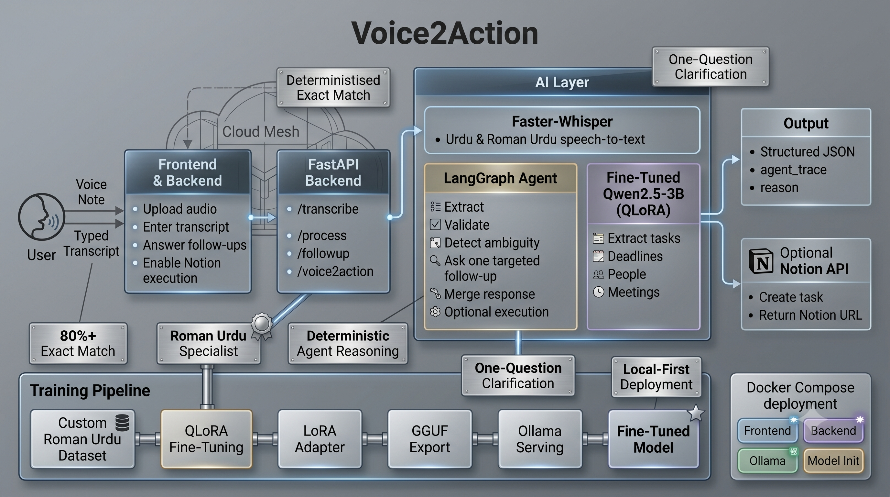

# Voice2Action

Voice2Action is an end-to-end agentic system for extracting structured tasks from informal Roman Urdu voice notes — the way hundreds of millions of people communicate daily.

It fine-tunes Qwen2.5-3B with QLoRA , wraps it in a LangGraph agent that detects genuine ambiguity and asks exactly one follow-up to close it, and optionally pushes the result to Notion — deployable in one command via Docker Compose.

---

## Overview

A fine-tuned Qwen2.5-3B (QLoRA) turns noisy Roman-Urdu speech into structured JSON. A LangGraph agent then validates the result, asks one targeted question when something is genuinely ambiguous, merges the answer back, and can execute the task in Notion. Speech-to-text uses Faster-Whisper; the model is served locally via Ollama.

```text
Input:   "yar client ne proposal bhejna hai friday tak aur Ali se approval bhi lena hai"
Output:  { "tasks": ["Send proposal", "Get approval from Ali"],
           "deadline": "Friday", "people": ["Ali"], "meetings": [] }

# Ambiguous input → one follow-up
Input:   "usko call karna hai"
Agent:   "Who should I call, and when does this need to be done?"
```

## Features

- **Fine-tuned domain model** — Qwen2.5-3B + QLoRA on 1,500+ curated examples; **95.9% exact match vs 21.6% zero-shot** ([results](#fine-tuning--results)).
- **LangGraph agent** — validates extraction, detects *genuine* ambiguity, asks one targeted question, merges the reply back.
- **Transparent decisions** — every response includes a deterministic, rule-based `agent_trace` and a `reason` for any follow-up (no extra LLM calls, no chain-of-thought).
- **Notion execution** — optional, off by default; creates the task via the official Notion API and returns the page URL.
- **Robust** — greedy decoding, JSON self-repair, grounded merges (won't invent a deadline or name), ask-each-gap-once, graceful empty-extraction recovery.
- **Local & containerized** — Faster-Whisper STT, Ollama serving, full stack via Docker Compose (optional NVIDIA GPU).

## Architecture



Three tiers: a Next.js client, a FastAPI orchestration layer, and the intelligence — Faster-Whisper for speech, a LangGraph agent over the fine-tuned model served by Ollama, and Notion as an executable tool. Everything runs locally; no data leaves the host unless Notion execution is enabled.

## Agentic Workflow

Two compiled LangGraph state graphs:

- **Process:** `extract → validate → (follow-up | notion | end)`
- **Follow-up:** `merge → validate → (follow-up | notion | end)`

The agent reasons about *genuine* gaps, not field presence:

- **Intent-aware ambiguity** — asks "who?" only when a task implies a person but none was resolved (never for `"buy milk"`).
- **Missing/vague deadlines** — a task or meeting with no concrete time (e.g. `"soon"`, `"jaldi"`) triggers "when?".
- **Grounded merges** — a follow-up reply can't introduce a deadline or name it doesn't actually contain.
- **Safe by default** — asks each gap once, never drops already-extracted tasks/meetings, recovers from missed extractions.

Questions are generated deterministically from the detected gap, so what's flagged and what's asked never drift. Notion execution runs only when `execute=true` **and** validation finds zero gaps.

## Tech Stack

| Layer | Technology |
|---|---|
| Frontend | Next.js 16 (React 19), TypeScript, Tailwind CSS v4 |
| Backend | FastAPI, Python 3.11, Uvicorn, httpx (Pydantic v2) |
| Speech-to-Text | Faster-Whisper (medium, int8) |
| Model | Qwen2.5-3B-Instruct, QLoRA fine-tuned |
| Serving | Ollama (merged adapter → GGUF q8_0) |
| Agent | LangGraph + LangChain Core |
| Tool execution | Notion REST API (official) |
| Training | Transformers, PEFT, BitsAndBytes (4-bit NF4 QLoRA) |
| Deployment | Docker, Docker Compose |

## Fine-Tuning & Results

QLoRA fine-tune (4-bit NF4, bfloat16) on 1,500+ Roman-Urdu / mixed-language examples — casual task mentions, multi-task entries with deadlines, compound actions, meetings, and chit-chat with no actionable task. The adapter is merged and exported to GGUF for Ollama. The dataset is iterated on real-world failures, with the held-out eval re-run each time to confirm a change helps.

**Config** (`ml/configs/qlora.yaml`): base `Qwen/Qwen2.5-3B-Instruct` · rank 16 · alpha 32 · LR 2e-4 · 3 epochs · max seq 1024 · targets q/k/v/o + gate/up/down proj.

Evaluated on a **148-example held-out test set** (stratified, position-spread split; zero train/test leakage). All conditions get the same system prompt and raw transcript, decoded greedily (`temperature 0`):

| Condition | JSON valid | Task F1 | People F1 | Meeting F1 | Deadline acc | **Exact match** |
|---|---|---|---|---|---|---|
| Base — zero-shot | 96.6% | 0.36 | 0.90 | 0.82 | 73.6% | **21.6%** |
| Base — few-shot (5 ex) | 100% | 0.72 | 0.93 | 0.83 | 81.8% | **45.9%** |
| **Fine-tuned** | **100%** | **0.99** | **0.99** | **1.00** | **98.6%** | **95.9%** |

Fine-tuning lifts exact-match from 21.6% (zero-shot) / 45.9% (5-shot) to **95.9%**, and task-extraction F1 from **0.36 → 0.99**. Base models copy literal names well (People F1 ≈ 0.90) but are weak at task extraction, which requires Roman-Urdu→English translation, splitting compound actions, and disciplined JSON.

> Numbers are in-distribution (held-out slice of the curated dataset); absolute scores drop on noisy real-world speech but the relative gap holds. Full per-example outputs: `ml/eval_results.json`.

## API Reference

| Method | Endpoint | Description |
|---|---|---|
| `GET` | `/health` | Health check |
| `POST` | `/transcribe` | Audio → transcript |
| `POST` | `/process` | Transcript → extraction + follow-up |
| `POST` | `/followup` | User reply → merged extraction |
| `POST` | `/voice2action` | Audio → full pipeline in one call |

`/process`, `/followup`, and `/voice2action` accept an optional **`execute`** flag (default `false`). When `true` and the extraction has no gaps, the task is created in Notion and its URL returned in `notion_url`. For `/voice2action`, pass it as a query param (`?execute=true`).

```jsonc
// POST /process — request
{ "transcript": "Ali ko call karna hai friday tak", "execute": false }

// response
{
  "extraction": { "tasks": ["Call Ali"], "deadline": "Friday", "people": ["Ali"], "meetings": [] },
  "missing_fields": [],
  "followup_question": null,
  "reason": null,
  "agent_trace": ["Extracted 1 task(s)...; deadline found", "Validation: no outstanding gaps"],
  "notion_url": null
}
```

When ambiguous, the follow-up fields are populated:

```jsonc
{
  "missing_fields": ["recipient", "deadline"],
  "followup_question": "Who should I send this to, and when does this need to be done?",
  "reason": "Asked because the task involves contacting someone but no recipient was named...",
  "agent_trace": ["...", "Validation: no resolved recipient — missing 'recipient'", "..."]
}
```

## Getting Started

**Prerequisites:** Docker + Docker Compose, and the quantized weights `ml/serving/voice2action-q8_0.gguf` (~3.3 GB). Build it once (see [`ml/README.md`](ml/README.md)) or drop a pre-built artifact into `ml/serving/`.

### Docker (recommended)

```bash
docker compose up      # Ollama :11434 · model-init · backend :8000 · frontend :3000
# open http://localhost:3000
```

GPU acceleration (needs the [NVIDIA Container Toolkit](https://docs.nvidia.com/datacenter/cloud-native/container-toolkit/install-guide.html)):

```bash
docker compose -f docker-compose.yml -f docker-compose.gpu.yml up
```

### Local development

```bash
# 1. Register the model with your host Ollama
cd ml/serving && ollama create voice2action -f Modelfile && cd ../..

# 2. Backend
cd backend && python -m venv .venv
.venv\Scripts\activate          # macOS/Linux: source .venv/bin/activate
pip install -r requirements.txt
cp .env.example .env            # set OLLAMA_MODEL=voice2action
uvicorn app.main:app --reload   # http://localhost:8000

# 3. Frontend
cd frontend && npm install && npm run dev   # http://localhost:3000
```

### Enable Notion execution (optional)

Create an integration at <https://www.notion.so/my-integrations>, share your tasks database with it, then set:

```bash
NOTION_TOKEN=secret_xxx
NOTION_DATABASE_ID=xxxxxxxxxxxxxxxxxxxxxxxxxxxxxxxx
NOTION_TITLE_PROP=Name          # optional; the DB's title column (default "Name")
```

Locally these go in `backend/.env`. **For Docker, put them in a root `.env`** (next to `docker-compose.yml`) — Compose reads that, not `backend/.env` — then `docker compose up -d --build`. The feature stays off until both token and database id are set; only the title property is used, so it works with any schema.

### Train from scratch

```bash
python ml/scripts/split_dataset.py                       # stratified 90/10 split
python ml/scripts/prepare_dataset.py --input ml/data/examples_train.jsonl --output ml/data/train.jsonl
python ml/scripts/train_qlora.py --config ml/configs/qlora.yaml   # needs a CUDA GPU
python ml/scripts/merge_lora.py                          # merge adapter → export GGUF (see ml/README.md)
python ml/scripts/evaluate.py                            # base vs fine-tuned on held-out set
```

## Deployment

Single Docker host (one VM) running the same `docker compose up`. A GPU is recommended but not required (Ollama serves the 3B on CPU, slower). Production notes:

- Get `voice2action-q8_0.gguf` onto the host (gitignored); for multi-host, push to a registry and switch `model-init` to `ollama pull`.
- Set `NEXT_PUBLIC_API_BASE_URL` (baked at frontend build time) to the public backend URL.
- Terminate TLS with a reverse proxy (Caddy/Nginx/Traefik); keep Ollama `:11434` internal.
- Tighten CORS (`allow_origins` in `app/main.py`) and persist the `ollama_data` / `hf_cache` volumes.
- Inject `NOTION_*` secrets at runtime via a root `.env` or secret store — never baked into the image.

Any GPU VM with Docker + the NVIDIA Container Toolkit works (AWS `g4dn`/`g5`, Azure NC/NV, GCP `g2`/T4, etc.). Single-node design; horizontal scaling is a later step.

## Roadmap

- [ ] WhatsApp bot interface — receive and respond to voice notes in-app

