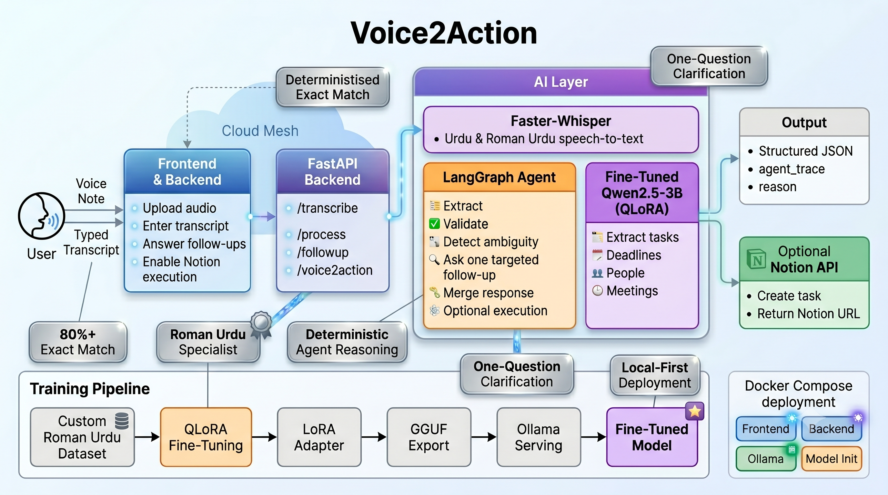

# Voice2Action

> **Turn informal Roman-Urdu / Urdu / mixed-language voice notes into structured, executable tasks.**
> A **QLoRA fine-tuned** domain LLM extracts `tasks · deadline · people · meetings`; a **LangGraph agent** validates the result, clarifies genuine ambiguity with one targeted question, and — optionally — **executes** the task in Notion.

> **What makes it more than a parser:** it's fine-tuned for a domain mainstream models handle poorly (95.9% exact match vs 21.6% zero-shot), it *reasons* about what's actually missing instead of demanding every field, it exposes a deterministic reasoning trace for every decision, and it can take a real action at the end — create the task in Notion.

---

## Overview

People communicate tasks informally — through voice notes, quick messages, and casual speech. Something like:

> *"yar client ne kaha proposal bhejna hai friday tak aur Ali se approval bhi lena hai"*

contains a deadline, two tasks, and a person — but buried in informal, mixed-language speech.

Voice2Action pairs two pieces that reinforce each other:

1. **A fine-tuned LLM** (Qwen2.5-3B + QLoRA) that turns noisy Roman-Urdu / mixed-language speech into clean, structured JSON — `tasks · deadline · people · meetings`.
2. **A LangGraph agent** that doesn't stop at extraction. It **validates** the result, **detects what's genuinely ambiguous** (an unnamed recipient, a missing or vague deadline, an undated meeting), asks **one targeted follow-up question**, and **merges the answer back** into the structured output.

The fine-tuned model supplies domain accuracy; the agent supplies completeness and trust — so the output is an action plan you can act on, not just a best-effort parse.

---

## Demo

**Input (voice note)**
```
yar client ne proposal bhejna hai friday tak aur Ali se approval bhi lena hai
```

**Extracted Output**
```json
{
  "tasks": ["Send proposal", "Get approval from Ali"],
  "deadline": "Friday",
  "people": ["Ali"],
  "meetings": []
}
```

**Agentic follow-up** — when a task is ambiguous, the agent asks one targeted question:
```
Input:  usko call karna hai          # "call him" — no name given
Agent:  Who should I call, and when does this need to be done?
```
Reply *"Ahmed ko, kal tak"* and the agent merges it back in → `Call Ahmed`, deadline `tomorrow`.

---

## Key Features

- **Fine-tuned domain model** — Qwen2.5-3B fine-tuned with QLoRA on a curated 1,500+ example dataset; it *measurably* beats prompting on Roman-Urdu task extraction ([results](#fine-tuning-results)), not just prompt engineering
- **Agentic reasoning loop (LangGraph)** — the system **validates** every extraction, **detects genuine ambiguity** (unnamed recipient, missing/vague deadline, undated meeting), asks **one targeted clarifying question**, and **merges** the reply back into the result — it reasons about what's actually missing instead of demanding every empty field
- **Transparent reasoning** — every response includes a deterministic, rule-based **`agent_trace`** (the high-level steps the graph actually took) and, whenever a follow-up is asked, a **`reason`** explaining *why* (by ambiguity type). No extra LLM calls, no chain-of-thought — just an honest mirror of the agent's decisions
- **Agentic tool execution: Notion integration for task creation** — optional and **off by default**. When an extraction is complete and unambiguous, the agent can create the task in your Notion database via the official API and return the page URL. It only acts when `execute=true` *and* validation finds zero gaps — never on ambiguous or empty input — so it's a real action, taken safely
- **Robust by design** — deterministic (greedy) decoding, JSON self-repair, *grounded* merges (won't invent a deadline or a name), ask-each-gap-once, spelling-robust deadline recovery for noisy variants, and graceful recovery when extraction returns empty
- **Roman Urdu / mixed-language first** — built for how people actually speak: informal, code-switched, spoken-language text
- **Full speech-to-text pipeline** — Faster-Whisper (medium) transcribes voice notes in Urdu and Roman Urdu
- **One-command deployment** — Docker Compose brings up the full stack: Ollama, the auto-registered fine-tuned model, the FastAPI backend, and the Next.js frontend (optional NVIDIA GPU via a compose override)

---

## Architecture

A clean three-tier split — a Next.js client, a FastAPI orchestration layer, and the intelligence (Faster-Whisper for speech, a LangGraph agent over a fine-tuned model served by Ollama, and Notion as an executable tool). Everything runs locally via Docker Compose; no data leaves the host unless Notion execution is enabled.




---

## Agentic Workflow

Extraction is only step one. The core of Voice2Action is a small, deliberate **LangGraph** agent that turns a raw extraction into a *complete, trustworthy* action plan. Two compiled graphs drive it:

- **Process graph:** `extract → validate → (conditional) → follow-up | Notion | end`
- **Follow-up graph:** `merge → validate → (conditional) → follow-up | Notion | end`

A conditional edge ends the graph immediately when nothing is ambiguous, so the agent only speaks up when it genuinely needs to — or, when execution is requested and the extraction is clean, routes to the optional Notion tool step instead.

**What the agent actually reasons about — not blind field-presence:**

- **Intent-aware ambiguity.** It asks *"who should I call?"* only when a task implies a person but none was resolved — never *"who's involved?"* for `"buy milk"`.
- **Missing & vague deadlines.** A task or meeting with no time — or a vague one like `"jaldi"` / `"soon"` — triggers a *"when?"*; an undated meeting is asked *"when is the meeting?"*.
- **Recovery from a missed extraction.** If the model returns nothing but the transcript clearly *was* a request, the agent replies *"I may have missed the task — could you rephrase…?"* instead of failing silently. Genuine chit-chat still returns cleanly empty.
- **Grounded, non-hallucinating merges.** A merged-in deadline or name is rejected unless it actually appears in the user's reply — a confused answer like `"what"` can't fabricate a `"tomorrow"`.
- **Never loses good output.** A follow-up may add or refine, but it can't drop tasks/meetings the model already extracted.
- **Asks each gap once.** Already-asked gaps are tracked, so the agent clarifies — it doesn't nag in a loop.

Each clarifying question is generated **deterministically from the detected gap**, so what the agent flags and what it asks can never drift apart. Combined with deterministic (greedy) extraction, JSON self-repair, and a clean `503` when the model service is unreachable, the pipeline behaves predictably under real-world, messy input.

**Inspectable decisions.** Two fields make the agent's behavior auditable without any extra model calls:

- **`agent_trace`** — a high-level, rule-based log of what each node decided (e.g. *"Extracted 1 task(s)… deadline not found" → "Validation: no concrete deadline — missing 'deadline'" → "Generated follow-up question for: deadline"*). It is built straight from the graph's control flow, so it always reflects the real path taken — not a generated narrative or chain-of-thought.
- **`reason`** — attached whenever a follow-up is asked, it states *why* in one sentence, mapped directly from the ambiguity type (unnamed recipient, missing/vague deadline, undated meeting, or a missed extraction). The frontend surfaces it inline as **"Why I asked."**

---

## Agentic Tool Execution: Notion Integration for Task Creation

Extraction and clarification produce a *plan*; this step lets the agent **act** on it. When enabled, a final tool node creates the task in your Notion database via the **official Notion API** and returns the new page's URL — turning Voice2Action from a parser into a lightweight agent that completes a real-world action end-to-end.

It is deliberately conservative:

- **Off by default.** Nothing changes unless you opt in. The feature only activates when `NOTION_TOKEN` and `NOTION_DATABASE_ID` are set *and* the request passes `execute=true`.
- **Only on a complete, unambiguous plan.** The agent routes to the Notion node **only when validation finds zero gaps** — so it never creates a page from ambiguous input (it asks the follow-up first) or from empty chit-chat (nothing concrete to create).
- **One page per voice note.** The page title summarizes the note; tasks become checkboxes and meetings bullets in the body, with the deadline and people listed below. Field mapping uses only the database's title property (configurable via `NOTION_TITLE_PROP`, default `Name`), so it works with **any** database schema — no assumptions about your columns.
- **Side-effects never lose the result.** If Notion is unreachable or misconfigured, the failure is recorded in `agent_trace` and the extraction is still returned — the API call doesn't fail over an action that didn't land.

**Enable it:**

```bash
# 1. Create an internal integration → https://www.notion.so/my-integrations
# 2. Share your tasks database with that integration
# 3. Set the credentials (never hardcoded):
export NOTION_TOKEN=secret_xxx
export NOTION_DATABASE_ID=xxxxxxxxxxxxxxxxxxxxxxxxxxxxxxxx
# optional, if your title column isn't called "Name":
export NOTION_TITLE_PROP=Name
```

With Docker, the backend reads these from the Compose environment, which pulls them from a **root `.env`** (next to `docker-compose.yml`) or your shell — `backend/.env` is *not* read by Compose. They're empty by default, so the stack runs unchanged when unset:

```bash
# repo root — picked up automatically by `docker compose up`
printf 'NOTION_TOKEN=secret_xxx\nNOTION_DATABASE_ID=xxxx\n' > .env
docker compose up -d --build      # --build so containers pick up the keys + latest code
```

Then send `execute=true`:

```bash
curl -X POST localhost:8000/process \
  -H 'Content-Type: application/json' \
  -d '{ "transcript": "Ali ko proposal bhejna hai friday tak", "execute": true }'
# → { ..., "notion_url": "https://www.notion.so/Send-proposal-to-Ali-…" }
```

In the UI, tick **"Create the task in Notion when nothing is ambiguous"** before extracting; the created page link appears in the result.

---

## Tech Stack

| Layer | Technology | Notes |
|---|---|---|
| **Frontend** | Next.js 16 (React 19), TypeScript, Tailwind CSS v4 | App Router; upload audio or type a transcript, answer follow-ups, opt into execution |
| **Backend** | FastAPI, Python 3.11, Uvicorn, httpx | Async REST API, Pydantic v2 validation, CORS-safe error handling |
| **Speech-to-Text** | Faster-Whisper (medium) | int8 quantized, Urdu + Roman Urdu |
| **Fine-tuned LLM** | Qwen2.5-3B-Instruct + QLoRA | The domain core — **95.9% exact match** vs 21.6% zero-shot ([results](#fine-tuning-results)) |
| **LLM Serving** | Ollama | Merged adapter exported to GGUF (q8_0), local inference |
| **Agent Framework** | LangGraph + LangChain Core | Two compiled state graphs: extract → validate → follow-up \| execute |
| **Tool Execution** | Notion REST API (official) via httpx | Optional, off by default — creates the task and returns the page URL |
| **Transparency** | Deterministic `agent_trace` + `reason` | Auditable, rule-based decision log — no extra LLM calls, no chain-of-thought |
| **Training** | Transformers, PEFT, BitsAndBytes | 4-bit NF4 QLoRA, bfloat16 compute |
| **Containerisation** | Docker, Docker Compose | One command for the full stack; optional NVIDIA GPU override |

---

## Fine-Tuning

Rather than relying on prompt engineering alone, the model is fine-tuned end-to-end on a curated dataset of **1,500+ Roman Urdu / mixed-language examples** covering:

- Casual task mentions (`yar Ali ko call karna hai`)
- Multi-task entries with deadlines (`proposal friday tak bhejna hai aur contract sign karna hai`)
- Compound "do X then send it" actions (`report banani hai phir Ali ko bhejni hai`)
- Meeting extraction (`monday ko client meeting hai 3 baje`)
- Everyday errands, and chit-chat with no actionable task (`doodh le ana`, `yaar aaj mausam acha hai`)

**Training configuration** (`ml/configs/qlora.yaml`):

| Parameter | Value |
|---|---|
| Base model | `Qwen/Qwen2.5-3B-Instruct` |
| Method | QLoRA (4-bit NF4, bfloat16 compute) |
| LoRA rank | 16 |
| LoRA alpha | 32 |
| Target modules | q/k/v/o proj + gate/up/down proj |
| Epochs | 3 |
| Learning rate | 2e-4 |
| Max sequence length | 1024 |

Fine-tuning produces a LoRA adapter that is merged and exported to GGUF format for local serving via Ollama.

### Iterative dataset development

The dataset is treated as a living asset. Real-world failures — transcripts the model mishandles in actual use — are continuously collected, reviewed, and folded into future training data, so coverage grows over time (for example, expanding under-represented patterns surfaced during testing). The held-out evaluation below is re-run after each iteration to confirm a change *helps* rather than regresses.

---

## Fine-Tuning Results

Does fine-tuning actually beat prompting? Measured on a **148-example held-out test set** that the model never saw during training (split stratified by example type *and* spread across the dataset to avoid positional bias; verified zero train/test leakage).

**Conditions** — all three receive the *same* system prompt and the raw transcript, decoded greedily (`temperature 0`). The only differences are in-context examples and fine-tuning:

1. **Base, zero-shot** — `qwen2.5:3b` with the instruction only
2. **Base, few-shot** — same model + 5 worked examples in context
3. **Fine-tuned** — the QLoRA-adapted `voice2action` model

**Results**

| Condition | JSON valid | Task F1 | People F1 | Meeting F1 | Deadline acc | **Exact match** |
|---|---|---|---|---|---|---|
| Base — zero-shot | 96.6% | 0.36 | 0.90 | 0.82 | 73.6% | **21.6%** |
| Base — few-shot (5 ex) | 100% | 0.72 | 0.93 | 0.83 | 81.8% | **45.9%** |
| **Fine-tuned** | **100%** | **0.99** | **0.99** | **1.00** | **98.6%** | **95.9%** |

> Fine-tuning lifted exact-match from **21.6%** (zero-shot) and **45.9%** (5-shot) to **95.9%**, and task-extraction F1 from **0.36 → 0.99** — gains prompting alone could not achieve. Few-shot prompting closed only about half the gap.

**Why the gap is where it is.** Base models are already decent at copying literal **names** (People F1 ≈ 0.90) — but weak at **task extraction** (F1 0.36), which requires Roman-Urdu→English translation, splitting compound actions, and disciplined JSON. That domain skill is exactly what fine-tuning installs.

**Representative cases** (base zero-shot vs. fine-tuned):

```text
Input:  yar utility bills pay karne hain aur contract sign karna hai June ke end tak
Base:   tasks as objects with an invented "priority" key — wrong schema
Tuned:  {"tasks": ["Pay utility bills", "Sign the contract"], "deadline": "end of June", ...}   ✓

Input:  sun presentation ready karni hai wednesday tak
Base:   {"tasks": ["sun presentation ready"], ...}        # untranslated, keeps filler "sun"
Tuned:  {"tasks": ["Prepare presentation"], "deadline": "Wednesday", ...}                       ✓

Input:  urgent hai Rukhsana ke sath sync karni hai
Base:   {"tasks": ["sync with Rukhsana"], "meetings": null}   # misclassifies a meeting as a task
Tuned:  {"tasks": [], "meetings": ["Sync with Rukhsana"], ...}                                  ✓
```

**Reproduce**

```bash
python ml/scripts/split_dataset.py            # stratified, position-spread 90/10 split
python ml/scripts/prepare_dataset.py --input ml/data/examples_train.jsonl --output ml/data/train.jsonl
python ml/scripts/train_qlora.py --config ml/configs/qlora.yaml
python ml/scripts/evaluate.py                 # base (0-shot + few-shot) vs fine-tuned → table
```

> **Scope note:** the test set is drawn from the same curated distribution, so these are strong *in-distribution* numbers; on noisy real-world speech all conditions drop somewhat, but the relative gap holds. Matching is lenient (set/substring/token-overlap) since task text is free-form; exact-match is the strict complement. Full per-example outputs: `ml/eval_results.json`.

---

## API Reference

| Method | Endpoint | Description |
|---|---|---|
| `GET` | `/health` | Health check |
| `POST` | `/transcribe` | Upload audio → returns transcript |
| `POST` | `/process` | Transcript → structured extraction + follow-up |
| `POST` | `/followup` | User reply → merges into existing extraction |
| `POST` | `/voice2action` | Upload audio → full pipeline in one call |

`/process`, `/followup`, and `/voice2action` accept an optional **`execute`** flag (default `false`). When `true` and the extraction has no gaps, the agent creates the task in Notion and returns its `notion_url`. For `/voice2action` (multipart upload) pass it as a query param: `POST /voice2action?execute=true`.

**`POST /process`** — request:
```json
{ "transcript": "Ali ko call karna hai friday tak", "execute": false }
```

**`POST /process`** — response:
```json
{
  "extraction": {
    "tasks": ["Call Ali"],
    "deadline": "Friday",
    "people": ["Ali"],
    "meetings": []
  },
  "missing_fields": [],
  "followup_question": null,
  "reason": null,
  "agent_trace": [
    "Extracted 1 task(s), 0 meeting(s), 1 person(s); deadline found",
    "Validation: no outstanding gaps"
  ],
  "notion_url": null
}
```

> `notion_url` is `null` unless `execute=true` was sent and the extraction had no gaps (and Notion is configured) — then it holds the created page's URL.

Every response also carries two transparency fields:

- **`agent_trace`** — a deterministic, rule-based list of the high-level steps the agent took (what was extracted, what gaps were detected, whether a question was generated). No LLM calls and no chain-of-thought — it mirrors the graph's actual decisions.
- **`reason`** — when a follow-up question is asked, a short rule-based explanation of *why* (derived from the ambiguity type: unnamed recipient, missing/vague deadline, undated meeting, or a missed extraction). `null` when no question is asked.

When a task is ambiguous, those fields look like:
```json
{
  "extraction": { "tasks": ["Send proposal"], "deadline": null, "people": [], "meetings": [] },
  "missing_fields": ["recipient", "deadline"],
  "followup_question": "Who should I send this to, and when does this need to be done?",
  "reason": "Asked because the task involves contacting someone but no recipient was named and no concrete deadline was provided.",
  "agent_trace": [
    "Extracted 1 task(s), 0 meeting(s), 0 person(s); deadline not found",
    "Validation: interaction task with no resolved recipient — missing 'recipient'",
    "Validation: no concrete deadline — missing 'deadline'",
    "Generated follow-up question for: recipient, deadline"
  ]
}
```

---

## Project Structure

```
voice-2-action/
├── backend/                  # FastAPI service
│   ├── app/
│   │   ├── agent/            # LangGraph nodes, graph definitions, prompts, LLM client
│   │   ├── api/              # REST routes
│   │   ├── stt/              # Faster-Whisper integration
│   │   ├── services/         # External-tool clients (Notion task execution)
│   │   ├── schemas.py        # Pydantic request/response models
│   │   ├── config.py         # Environment settings
│   │   └── main.py           # FastAPI app entry point
│   ├── tests/                # Pytest smoke tests
│   └── Dockerfile
├── frontend/                 # Next.js 16 app
│   ├── app/                  # App router pages
│   ├── lib/                  # API client utilities
│   └── Dockerfile
├── ml/                       # Model training & serving
│   ├── configs/
│   │   └── qlora.yaml        # QLoRA training configuration
│   ├── data/
│   │   ├── examples.jsonl    # Curated training examples (1,500+)
│   │   ├── train.jsonl       # Formatted training split
│   │   └── test.jsonl        # Held-out evaluation split
│   ├── scripts/
│   │   ├── prepare_dataset.py  # Formats examples into chat template
│   │   ├── split_dataset.py    # Stratified, position-spread train/test split
│   │   ├── train_qlora.py      # QLoRA fine-tuning entrypoint
│   │   ├── merge_lora.py       # Merges adapter into base model
│   │   ├── evaluate.py         # Base vs fine-tuned metrics on held-out test
│   │   └── infer.py            # Local inference sanity checks
│   └── serving/
│       └── Modelfile           # Ollama model definition
├── docker-compose.yml          # Ollama + model-init + backend + frontend
├── docker-compose.gpu.yml      # GPU override
└── README.md
```

---

## Getting Started

### Prerequisites

- [Docker](https://www.docker.com/) and Docker Compose
- The quantized model weights: `ml/serving/voice2action-q8_0.gguf` (~3.3 GB)

> **Generate the GGUF once** before running Docker. See [`ml/README.md`](ml/README.md) for the full training → merge → export pipeline. If you have a pre-built artifact, drop it directly into `ml/serving/`.

### Option A — Docker (recommended)

```bash
docker compose up
```

This starts:
1. **Ollama** (model server) on port `11434`
2. **model-init** — one-shot service that registers the fine-tuned `voice2action` model (idempotent)
3. **Backend** (FastAPI) on port `8000`
4. **Frontend** (Next.js) on port `3000`

Then open **http://localhost:3000**.

For GPU acceleration (requires [NVIDIA Container Toolkit](https://docs.nvidia.com/datacenter/cloud-native/container-toolkit/install-guide.html)):

```bash
docker compose -f docker-compose.yml -f docker-compose.gpu.yml up 
```

### Option B — Local Development

```bash
# 1. Register the model with your host Ollama instance
cd ml/serving
ollama create voice2action -f Modelfile
cd ../..

# 2. Backend
cd backend
python -m venv .venv

# Windows
.venv\Scripts\activate
# macOS / Linux
# source .venv/bin/activate

pip install -r requirements.txt
cp .env.example .env        # set OLLAMA_MODEL=voice2action
uvicorn app.main:app --reload
# → http://localhost:8000
```

```bash
# 3. Frontend
cd frontend
npm install
npm run dev
# → http://localhost:3000
```

### Training From Scratch

```bash
# from the repo root

# 1. Split (stratified, position-spread) + format for training
python ml/scripts/split_dataset.py
python ml/scripts/prepare_dataset.py --input ml/data/examples_train.jsonl --output ml/data/train.jsonl

# 2. Fine-tune (requires a CUDA GPU)
python ml/scripts/train_qlora.py --config ml/configs/qlora.yaml

# 3. Merge adapter into base, then export to GGUF (see ml/README.md)
python ml/scripts/merge_lora.py

# 4. Evaluate fine-tuned vs base prompting on the held-out set
python ml/scripts/evaluate.py
```

---

## Deployment

Voice2Action ships as a Docker Compose stack, so the simplest production path is a **single Docker host** (one VM) running the same `docker compose up` you use locally. A GPU is recommended for low-latency LLM inference but not required — Ollama also serves the 3B model on CPU, just slower.

**Production checklist (any provider):**

- **Get the model artifact onto the host.** `ml/serving/voice2action-q8_0.gguf` is gitignored, so build it (see [`ml/README.md`](ml/README.md)) or copy it to the server before `docker compose up`. For multi-host setups, push the model to a registry and switch the `model-init` step to `ollama pull`.
- **Point the frontend at the public backend URL.** `NEXT_PUBLIC_API_BASE_URL` is baked at build time, so set it to your real API URL (edit the build arg in `docker-compose.yml`, or pass `--build-arg NEXT_PUBLIC_API_BASE_URL=https://api.yourdomain.com` when building the `frontend` image) — `localhost` only works for local runs.
- **Front it with HTTPS.** Put a reverse proxy (Caddy / Nginx / Traefik) in front, terminating TLS and routing to the frontend (`:3000`) and backend (`:8000`). Keep Ollama (`:11434`) **internal** — don't expose it.
- **Tighten CORS.** Replace the backend's `allow_origins=["*"]` (`app/main.py`) with your frontend domain.
- **Persist volumes.** `ollama_data` (model) and `hf_cache` (Whisper) so restarts don't re-download multi-GB files.
- **Inject secrets at runtime, not in the image.** If you enable Notion execution, provide `NOTION_TOKEN` / `NOTION_DATABASE_ID` via a root `.env` or your orchestrator's secret store — `.env` is gitignored and dockerignored, so credentials never bake into the image.

**AWS** — a GPU EC2 instance (`g4dn.xlarge` / `g5.xlarge`) with Docker + the NVIDIA Container Toolkit, then `docker compose -f docker-compose.yml -f docker-compose.gpu.yml up -d`. Open 80/443 in the security group; keep 8000/11434 private. CPU instances (`t3`/`m5`) also work, just slower. ECS/EKS is possible but heavier than a single host for this stack.

**Azure** — a GPU VM (NC / NV series) with Docker + NVIDIA Container Toolkit, same compose command. For a more managed split, host the backend + frontend images on Azure Container Apps / Container Instances with Ollama on a GPU VM.

**Anywhere else** — any VM with Docker + Compose works (GCP `g2`/T4, DigitalOcean, Hetzner, RunPod, Lambda…). GPU hosts give the best latency; CPU is fine for demos and light traffic.

> This is a single-node design. Horizontal scaling (a separate Ollama pool, multiple backend replicas behind a load balancer) is a later step, not required to ship.

---
<!-- 
## Example Use Cases

| Voice Note | Extracted |
|---|---|
| `"Ali ko call karna hai"` | Task: Call Ali |
| `"Proposal friday tak bhejna hai"` | Task + deadline: Friday |
| `"Monday ko client meeting hai 3 baje"` | Meeting: Monday 3pm |
| `"Electricity bill pay karna hai aaj tak"` | Task + deadline: today |
| `"Usko call karna hai"` | Task: Call … → agent asks *"Who should I call?"* |
| `"Doodh le ana"` | Task: Buy milk |

--- -->

## Why This Matters

Roman Urdu is how hundreds of millions of people communicate daily — in WhatsApp messages, voice notes, and casual speech — but it is almost entirely absent from standard NLP tooling. This project demonstrates that a small, fine-tuned model (3B parameters) can outperform generic prompting on this domain by learning the specific vocabulary, sentence structures, and mixed-language patterns that characterise real Pakistani communication.

But extraction alone isn't enough: real voice notes omit details. The LangGraph agent closes that gap — validating each result, detecting genuine ambiguity, asking one targeted question, and merging the answer back — with grounded, deterministic behavior designed not to hallucinate or nag. The fine-tuned model supplies domain accuracy; the agent supplies completeness and trust.

<!-- ---

## Scope & Limitations

Stated up front, since they shape how the project is built and evaluated:

- **One deadline per note.** The schema carries a single deadline, so a note with two tasks on different dates collapses to one. Per-task deadlines are a planned schema change.
- **In-distribution evaluation.** The reported metrics are on a held-out slice of the curated dataset; genuinely noisy real-world speech is harder (the fine-tuned-vs-prompting gap holds, but absolute numbers drop). This is exactly why dataset development is treated as continuous.
- **Recipient resolution depends on the model.** Unnamed pronoun references (`usey`, `usko`) are an active coverage area being expanded in the dataset; when extraction leaves a recipient unresolved, the agent already detects it and asks *"who?"*. -->

---

## Future Roadmap

<!-- - [ ] Google Calendar / Outlook integration — auto-schedule extracted tasks -->
- [ ] WhatsApp bot interface — receive and respond to voice notes in-app
<!-- - [ ] Personal task memory — cross-session context and history
- [ ] Mobile app (Flutter / React Native)
- [ ] Multilingual expansion — Arabic, Hindi, Bengali -->

---

<!-- *Built with FastAPI · LangGraph · Faster-Whisper · Qwen2.5 · QLoRA · Next.js · Docker* -->